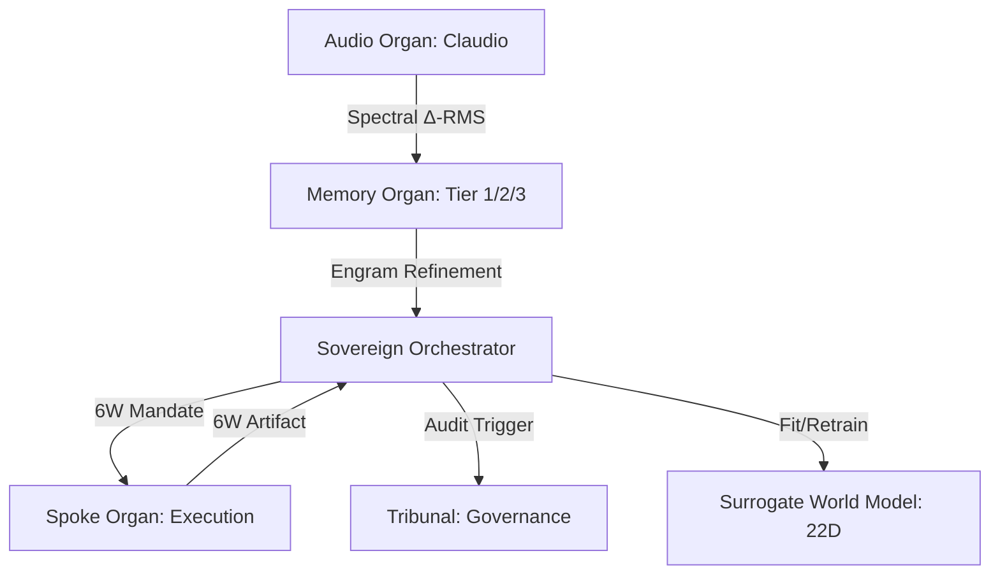

# MISSION_CONTROL.md — TooLoo V2 Fast-Boot Situational Awareness

> **For LLMs:** Read this FIRST. Single-page snapshot: goal, state, next task, top rules.
> Update the four sections below each session (replace, don't append).
> Full history → `PIPELINE_PROOF.md`. Full architecture → `README.md`.

---

## Current State
- branch: main
- live-mode status: **GALACTIC SOVEREIGN ENGINE (ASCENDED)**
- **Deployment**: `sovereign-hub-v2` LIVE in `me-west1` (Tel Aviv).
- **URL**: `https://sovereign-hub-v2-gru3xdvw6a-zf.a.run.app`
- **Sovereign Tier**: 22D Cognitive state persistent via GitHub-backed Soul-Sync.
- **Stage 6 Mega-SOTA Synthesis**: O1-Reasoning, Action Telemetry, and Local-Failover (Ollama) implemented and verified.
- **Stage 7 Galactic Ascension**: Permanent Cloud Run Hub established with 100% operational autonomy.

## Active Blockers
- No critical blockers. System is fully operational.

## Immediate Next Steps
1. **Autonomous Scale-Out:** Trigger galactic spawning of Spoke instances for high-concurrency audio synthesis tasks.
2. **Path C Integration:** (In Progress) Finalizing the DeepSeek-V3 rescue pathway for ultra-low-latency 6W-stamped audits.
3. **Galactic Dashboard:** Expose the Sovereign 22D model drift and convergence metrics in the Studio UI.

*Last updated: 2026-03-29 (Sovereign Architect — Galactic Ascension achieved)*

## JIT Bank (Last 5 Rules)

1. **Intent vs Result**: Execution success is strictly bound to `success_criteria` tracked in `LockedIntent`. Passing unit tests is no longer enough to close a wave if the intent gap remains.
2. **Reconciliation Injection**: Failed intent waves instantly inject `[INTENT GAP DETECTED]` plus a clear proposed remedy back into the N-Stroke `mandate_text`.
3. **Global Alignment Strategy**: The `MetaArchitect` reads global contextual interests from persistent memory *before* constructing the DAG, weighting Swarm Personas (e.g. Sustainer vs Innovator) proactively.
4. **CognitiveMap.to_dict() enrichment is fail-safe** — try/except wraps the lazy import so a DeepIntrospector build failure never breaks the cognitive map REST response.
5. **System health traffic light thresholds** — green: avg_health >= 0.8 AND all critical modules healthy. Yellow: avg >= 0.6. Red: below 0.6.

---

## Sovereign Organ Map

| What | Where |
|------|-------|
| Config / env vars | `engine/config.py` |
| ~92 API endpoints | `studio/api.py` (search `/v2/`) |
| Deep Introspector | `engine/deep_introspector.py` → `get_deep_introspector()` |
| Notification Bus | `engine/bus.py` → `get_bus()` |
| Cognitive Stance | `engine/stance.py` → `get_stance_engine()` |
| Cognitive Map | `engine/cognitive_map.py` → `get_cognitive_map()` |
| Self-improve loop | `engine/self_improvement.py` → `SelfImprovementEngine` |
| Parallel validation | `engine/parallel_validation.py` → `ParallelValidationPipeline` |
| Autonomous loop | `ouroboros_cycle.py` (gated by `TOOLOO_LIVE_TESTS`) |
| Run tests | `pytest tests/ --ignore=tests/test_ingestion.py --ignore=tests/test_playwright_ui.py` |

*Last updated: 2026-03-29 (Sovereign Hub-Spoke Final V2)*
