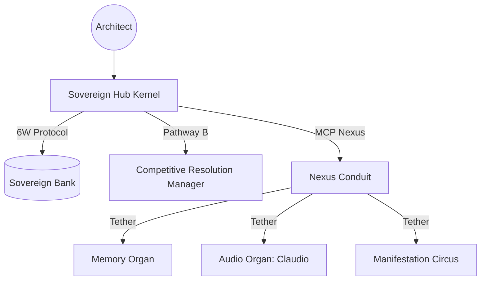

# MISSION_CONTROL.md — TooLoo V3 Sovereign Pure Situational Awareness

> **For LLMs:** Read this FIRST. V3 Hub: Stateless Reasoning, Federated Organs, 6W-Stamped.

---

## Current State
- branch: main
- live-mode status: **SOVEREIGN FEDERATED PURE (v3.1.0)**
- **Architecture**: Stateless Hub Kernel + Federated Cloud Organs (GCP) + Local Visual Circus.
- **Verification**: End-to-end 6W-Stamping active.
- **Purity**: Zero legacy contamination. 

## Active Blockers
- **NONE**: Sovereign Transition Phase 3 Complete.

## Next Steps
1. **World Model 22D**: [ACTIVE] Federated Calibration & Tensor Refinement Pulse.
2. **Cognitive Scale-Out**: [ACTIVE] Pathway B Competitive Resolution Hub-Level Integration.

*Last updated: 2026-03-29 (Sovereign Architect — Hub Is Live)*

## JIT Bank (V3 Rules)

1. **Pure Hub**: The Hub MUST NOT execute local system commands or read/write files directly; it MUST delegate all physical acts to tethered Organs via the MCP Nexus.
2. **6W-Stamping**: No cognitive act is considered "real" until it is stamped and recorded in the Sovereign Bank.
3. **Stateless Reasoning**: The Orchestrator's state is isolated to the current goal's context; long-term state exists ONLY in the Federated Memory Organ.
4. **Nexus Tethering**: All external communication must pass through the `mcp_nexus.py` secure conduit.
5. **Architectural Foresight**: Every 6W stamp must include a `why` field that reconciles the current act with the Macro-Goal.

---

## Sovereign V3 Hub Topology

| Component | Responsibility | Location |
|-----------|----------------|----------|
| **Kernel** | Stateless Reasoning & Orchestration | `tooloo_v3_hub/kernel/` |
| **Nexus** | Federated Conduit / MCP Client | `tooloo_v3_hub/kernel/mcp_nexus.py` |
| **Bank** | Metadata, Weights, Engrams | `tooloo_v3_hub/psyche_bank/` |
| **Legacy** | Historical Archive | `archive/tooloo-v2-legacy/` |
| **Lab** | Experimental & Demo Scripts | `lab/` |

*Last updated: 2026-03-29 (Sovereign Hub V3 Pure)*
