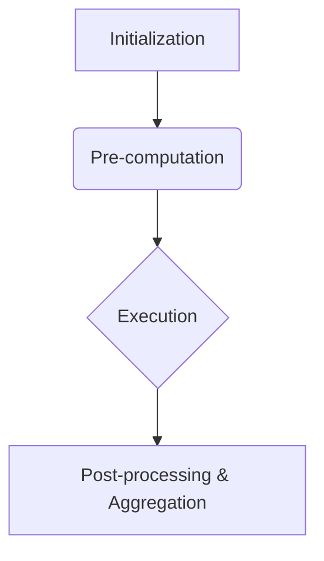

# TooLoo DAG Pipeline Architecture

This document explains the TooLoo DAG pipeline architecture, following the Diátaxis framework for clarity.

## Overview

The TooLoo DAG pipeline is a sophisticated execution engine designed to manage complex workflows represented as Directed Acyclic Graphs (DAGs). It ensures robust, efficient, and reproducible execution of tasks.

## Core Components

*   **DAG Definition:** A declarative representation of the workflow, defining nodes (tasks) and their dependencies.
*   **Execution Engine:** The core component responsible for interpreting the DAG and orchestrating task execution.
*   **Node Execution:** Individual tasks within the DAG, each with its own logic and parameters.
*   **Dependency Management:** Ensures tasks are executed only after their prerequisites are met.
*   **Parallelism:** Leverages available resources to execute independent tasks concurrently.
*   **Result Aggregation:** Collects and consolidates outputs from individual nodes.

## Execution Waves

The DAG execution follows a four-wave process:

1.  **Initialization:** Loading and validating the DAG structure, including dependency checks.
2.  **Pre-computation:** Preparing nodes by resolving inputs, configurations, and performing static analysis.
3.  **Execution:** Running the core logic of each node, potentially in parallel, storing intermediate results.
4.  **Post-processing & Aggregation:** Consolidating results, performing final checks, generating reports, and handling errors.

## Diagram

## Implementation Blueprint

### Files:

*   `docs/architecture/pipeline.md`: This documentation file.
*   `src/tooloo/dag_pipeline.py`: Contains the core `DAGPipeline` class.

### Classes & Interfaces:

*   **`src/tooloo/dag_pipeline.py`**
    *   `class DAGPipeline`
        *   `def execute(dag: DAG) -> ExecutionResult:`: Orchestrates the entire DAG execution process.

### 4-Wave DAG Execution Order:

1.  **Wave 1: Initialization**
    *   **Purpose:** Load and validate DAG definition.
    *   **Description:** Parses DAG structure, checks for circular dependencies, and performs initial node validation.

2.  **Wave 2: Pre-computation**
    *   **Purpose:** Prepare nodes for execution.
    *   **Description:** Resolves dependencies, gathers necessary data/configurations, and potentially performs static analysis on code nodes.

3.  **Wave 3: Execution**
    *   **Purpose:** Run the core logic of each node.
    *   **Description:** Executes node operations in parallel where possible, respecting dependencies. Results are stored.

4.  **Wave 4: Post-processing & Aggregation**
    *   **Purpose:** Consolidate results and finalize the DAG run.
    *   **Description:** Aggregates node outputs, performs final checks, generates reports, and handles error propagation.
