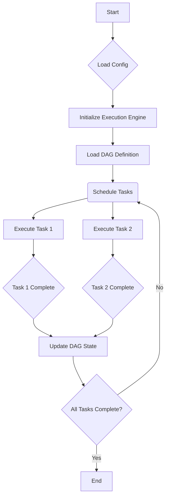

# TooLoo V2 DAG Pipeline Architecture

TooLoo V2 operates as an autonomous Directed Acyclic Graph (DAG) cognitive OS. The pipeline is orchestrated by a central engine that manages the execution of tasks (nodes) defined in a DAG.

## Core Components

*   **DAG Definition**: Specifies the tasks, their dependencies, and execution order.
*   **Execution Engine**: Manages the lifecycle of the DAG, scheduling and executing tasks. This engine is designed to be stateless, ensuring reproducibility and scalability.
*   **Processors (Nodes)**: Represent individual tasks within the DAG. These are stateless Python functions or classes that perform specific operations (e.g., data analysis, tool invocation, code generation).
*   **Configuration**: All configurable parameters, such as execution strategies (e.g., sequential, parallel), resource limits, and logging levels, are externalized to `engine/config.py` using Pydantic v2 models for robust validation.
*   **Observability**: Integrates OpenTelemetry for distributed tracing and structured JSON logging with correlation IDs for comprehensive monitoring.

## Architecture Diagram (Mermaid.js)

## Design Principles

*   **Statelessness**: Processors are designed to be stateless, relying on externalized configuration and persistent storage for state management. This aligns with modern distributed system patterns and facilitates easier testing and scaling.
*   **Config-Driven**: `engine/config.py` is the single source of truth for all operational parameters, managed by Pydantic v2 models.
*   **SOTA Practices**: Adheres to State-Of-The-Art (SOTA) practices, including the use of FastAPI and Pydantic v2 for async Python services, OpenTelemetry for tracing, and structured logging.
*   **Documentation**: Follows the Diátaxis framework for documentation structure (tutorials, how-tos, reference, explanation).

## Compliance Considerations

*   **LLM-Generated Runbooks**: Any LLM-generated runbooks or operational procedures require mandatory human review to comply with SOX/ISO 27001 standards, ensuring accuracy and security before deployment.
